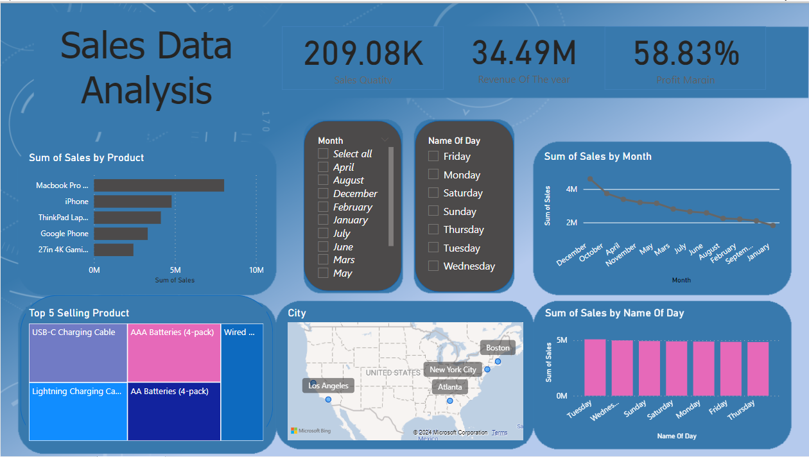

# Sales-Data-Analysis
In this project, I dove into a large sales data set to extract valuable insights. I explored sales trends over time, identified top-selling products, calculated revenue metrics such as total sales and profit margins, and created visualizations to present my results effectively. This project highlighted my ability to manipulate and derive insights from large data sets, allowing me to make data-driven recommendations to optimize sales strategies.

